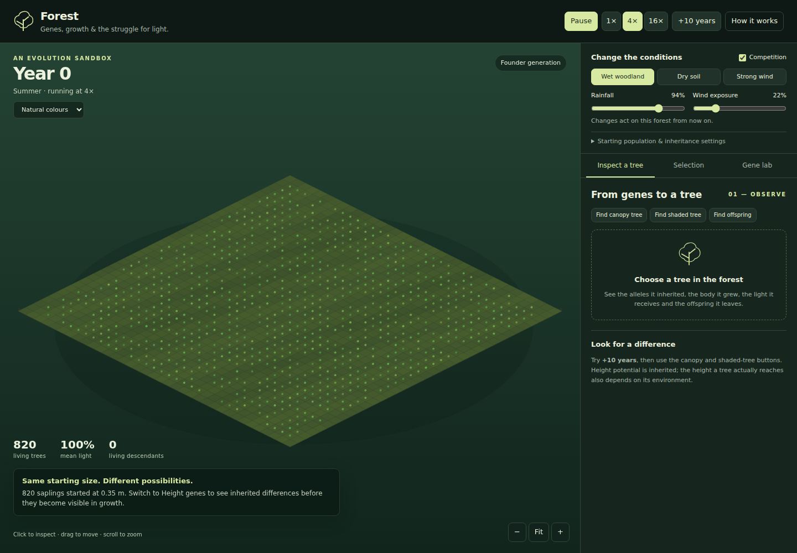

# Forest

**Genes, growth & the struggle for light.**

**[Open Forest](https://splargdotcom.github.io/forest/)**

<!-- site-screenshot:start -->
<p align="center">
  <a href="https://splargdotcom.github.io/forest/"></a>
</p>
<!-- site-screenshot:end -->

Forest is an interactive browser-based evolution sandbox. It starts with a crowded population of genetically varied saplings and lets you watch inherited traits interact with light, water, neighbours, reproduction, mutation and changing environmental conditions.

The aim is educational rather than predictive: the model makes the chain from **genotype → phenotype → competition → reproductive success → inheritance** visible and testable.

## Highlights

- Five additive diploid traits: **height potential, growth pace, crown spread, root investment and wood investment**
- Crowded forest with competition for **light, water and space**
- Reproducible runs using a fixed random seed
- Rainfall, wind and competition controls
- Canopy gaps and natural mortality
- Tree inspector showing alleles, expressed traits, resources and offspring
- Population-level selection charts
- Controlled **Competition ON vs OFF** selection experiment
- Gene Lab experiments:
  - same genes, different light
  - same environment, different height genes
- Pedigree tracing across generations
- Exact allele-copy tracing, including mutation branches
- Desktop and mobile layouts
- No build step and no external runtime dependencies

## Run locally

Clone the repository and open `index.html` in a modern browser:

```bash
git clone https://github.com/splargdotcom/forest.git
cd forest
```

You can open `index.html` directly, or serve the folder locally:

```bash
python3 -m http.server 8000
```

Then visit `http://localhost:8000`.

## Suggested experiment

1. Start with **Height genes** selected in the colour menu.
2. Advance the forest by several decades.
3. Inspect a canopy tree and a shaded tree.
4. Open **Selection** and run the paired competition experiment.
5. Open **Gene Lab** to compare genetic and environmental effects separately.
6. Trace a successful tree's pedigree or click one allele to follow that allele copy through descendants.

The important point is that no trait is simply labelled "best". A trait's costs and benefits depend on the environment.

## Model notes

This is a teaching model, not a calibrated forecast of a real forest.

- Trait inheritance is deliberately simplified.
- Each model trait is represented by two additive numeric alleles.
- Real tree traits are usually polygenic and interact in more complicated ways.
- Mutations are random with respect to need.
- Selection emerges from survival and reproduction; there is no target genome or guaranteed winner.
- The forest has overlapping generations rather than discrete generational replacement.

## Source

The current application is self-contained in the root `index.html`.

## GitHub Pages

The live build is published at **https://splargdotcom.github.io/forest/**. GitHub Actions redeploys the site automatically when `main` changes.

## License

MIT. See [LICENSE](LICENSE).
